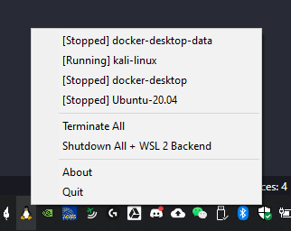

# wsl-tray

wsl-tray is a lightweight Windows tray application for easily managing WSL 2 VMs.

Whenever you need to conveniently terminate all WSL 2 VMs to free resources from the system, or just start a random distribution for a one-liner test, wsl-tray is your friend.

## Features

- Right-click from the system tray to get the only menu of this application.

- Click on any WSL distribution to toggle its status (Running <-> Stopped).

- Click on "Shutdown/Terminal All" to quickly free resources from WSL 2.

## Requirements
- Windows Only
- WSL 2 Only
- Python 3.7+ if you are installing from PyPI

## Get the App

Head to [Release](https://github.com/yzgyyang/wsl-tray/releases) to download the latest release version. 

Put a link to the file to Startup so it can quietly start with the system.

## Credits

`systray` portion of the code was imported from [infinidat/infi.systray](https://github.com/Infinidat/infi.systray) with some small modifications.

Icons made by [Pixel perfect](https://www.flaticon.com/authors/pixel-perfect) from [Flaticon](www.flaticon.com).

## Changelog
[CHANGELOG](https://github.com/yzgyyang/wsl-tray/blob/master/CHANGELOG.md)

## License
[BSD3](https://github.com/yzgyyang/wsl-tray/blob/master/LICENSE)
